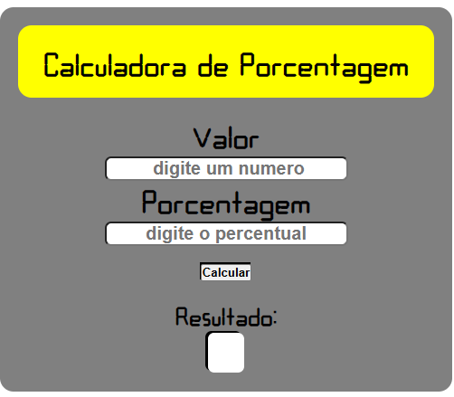

Calculadora de Porcentagem

Uma calculadora simples para calcular porcentagem.

📷 Imagem da interface. 

🚀 Tecnologias

HTML

CSS

JavaScript

🎨 Características

Interface estilizada com estética Vaporwave

Dois campos de entrada para valores

Botão para calcular rapidamente a porcentagem

Responsivo e fácil de usar

📌 Como Usar

Insira o valor base no primeiro campo.

Insira a porcentagem desejada no segundo campo.

Clique no botão para calcular.

O resultado será exibido na tela.

📂 Estrutura do Projeto

📁 calculadora-porcentagem
 
 ├── index.html
 
 ├── style.css
 
 ├── script.js

